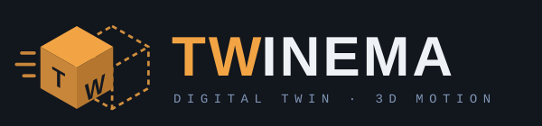
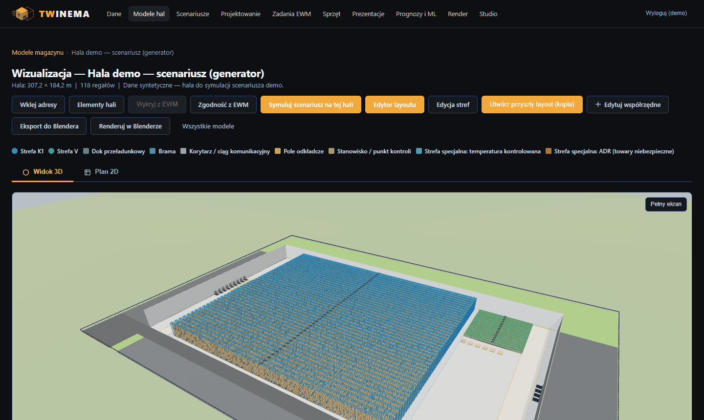
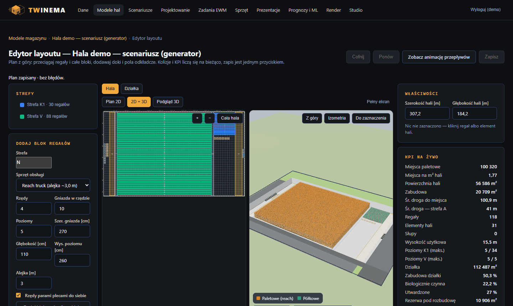

# TWINEMA

> **What it is:** TWINEMA is a warehouse digital twin you can present like a film. It lets you design
> a distribution centre in 3D (hall, racks, docks, plot), simulate a design day on that layout and turn
> the result into a browser presentation, a Blender-rendered video with voice-over and a PDF deck.
> Django 5.2 + three.js + Blender; all demo data is synthetic. UI and docs are in Polish.





**Cyfrowy bliźniak magazynu, który da się pokazać jak film.**

TWINEMA łączy projektowanie centrum dystrybucyjnego w 3D z symulacją pracy i produkcją
prezentacji: układ hali i regałów → symulacja dnia projektowego → animacja przepływów
w Blenderze → film z lektorem (ElevenLabs) i deck PDF.

> **Stan:** działa pełna ścieżka od danych do pokazu — import danych (materiały, lokalizacje, stany), model i edytor hali z działką, scenariusze z symulacją i animacją dnia, katalog sprzętu, prognozy i segmentacja ML, render w Blenderze przez kolejkę i workera, Studio (film z lektorem + deck PDF) oraz prezentacja 3D w przeglądarce dla zarządu (przeloty po hali, wyniki dnia, szczyt, wąskie gardła, wnioski). Mapa drogi i decyzje: [`docs/PLAN.md`](docs/PLAN.md).

## Moduły

| Moduł | Co robi | Faza |
|---|---|---|
| Scenariusze | wolumeny dnia typowego i szczytowego: plan przyjęć (kontenery, auta 33-pal., solówki; min/śr/max), doki w szczycie, osobogodziny; symulacja dnia na layoucie (kolejki aut, pola odkładcze, obsada, flota; średnia i P95; wąskie gardła z podpowiedziami); pojemność i strefy specjalne vs stan, nośność; porównanie layout × scenariusz, eksport xlsx; **animacja dnia** w 3D (każde auto, kontener i paleta w czasie dnia, ×10–×300, skok do szczytu, wąskie gardła na czerwono, pełny ekran) | S2a ✅ · S3a ✅ · S3b ✅ · S4 ✅ |
| Dane | importy materiałów, mastera lokalizacji i stanów z raportem odrzuceń; opakowania sztuka → karton → paleta, katalog nośników, klasy wysokości/wagi, ręczna ABC, strefy specjalne; dane demo | F2 ✅ · S1 ✅ |
| Model hali | generator hali, regały, strefy, pola odkładcze, warianty, widok 3D | F1 ✅ |
| Edytor layoutu | plan z góry w przeglądarce: przeciąganie regałów i całych bloków, doki i pola odkładcze, kolizje i KPI na żywo, cofnij/ponów, zapis; konstrukcja hali — słupy, wysokość w świetle, drogi pożarowe i ruchu, strefy ładowania i specjalne, podkład z rzutu z kalibracją skali; podgląd 3D obok planu, „przyszły layout” jako kopia hali, pełny ekran (F) w edytorze i widoku 3D; grafika 3D z paletami w regałach, ścianami hali (przekrój), dokami, cieniami — przełącznik **Jakość: wysoka / szybka** w rogu sceny; **działka**: wymiary, linie zabudowy, % zabudowy i zieleni, maks. wysokość, wjazdy, plac/parking/zieleń — z walidacją i terenem w 3D | E2 ✅ · E2b ✅ · E3 ✅ · G1 ✅ · D1 ✅ |
| Katalog sprzętu | wózki paletowe, czołowe, reach, VNA, AGV/AMR, przenośniki: prędkości, podnoszenie, udźwig z krzywą, alejka Ast, bateria; klasy ogólne + własne modele z kart katalogowych — zasilają walidację layoutu i symulację floty | K1 ✅ |
| Symulacja | dzień projektowy, flota, kalibracja, porównanie wariantów | F1 ✅ |
| Prognozy i ML | Holt-Winters i spółka kontra baseline (MAPE), segmentacja materiałów k-means | F4 ✅ |
| Render 3D | kolejka ujęć, worker Blendera na PC (HTTPS + token), presety kamery, PNG/MP4 w aplikacji | F3 ✅ |
| Prezentacje 3D | pokaz w przeglądarce: slajdy z ujęciami kamery, planszami KPI, szczytem animacji dnia i wąskimi gardłami; szablon startowy z modelu i wyniku symulacji, edytor slajdów, pełny ekran, wersja tekstowa | P1 ✅ |
| Studio prezentacji | scenariusz (szablon albo Claude), lektor ElevenLabs z napisami, klipy i kadry z Blendera, montaż MP4, deck PDF | F5 ✅ |

### Jak pokazać projekt zarządowi

1. **Model hali** z działką w edytorze (np. kopia obecnej hali jako „przyszły layout”).
2. **Scenariusz** (dzień typowy / szczytowy) → „Uruchom symulację” na tym modelu.
3. Przy wyniku symulacji: **„prezentacja 3D”** → „Utwórz ze szablonu” — powstaje pokaz: działka → hala → strefy → doki → wyniki dnia → pojemność i działka → szczyt dnia → wąskie gardła → podsumowanie z liczbami.
4. Popraw podpisy, ustaw kamerę i kliknij **„+ Bieżące ujęcie”** dla własnych kadrów, zapisz.
5. Wyślij adres prezentacji (przycisk „Kopiuj”) osobom z rolą **Podgląd** — widzą tylko pokaz (bez danych źródłowych). Pokaz: ← → albo klik, **F** — pełny ekran, „Odtwarzaj automatycznie”.

### Jak powstaje film i deck

1. **Kwestie** — szkic z KPI modelu (szablon) albo z Claude; do AI idą tylko zagregowane liczby. Projektant poprawia i zatwierdza tekst.
2. **Lektor** — ElevenLabs nagrywa kwestię po kwestii ze znacznikami czasu; długość ujęcia = długość nagrania, napisy SRT z czasów słów.
3. **Render** — jeden klik kolejkuje dla każdego ujęcia klip MP4 (film) i kadr PNG (deck); worker z Blenderem renderuje na PC.
4. **Montaż** — worker z ffmpeg skleja planszę tytułową, ujęcia z lektorem, planszę końcową i napisy → MP4.
5. **Deck PDF** — slajdy 16:9 z serwera: tytuł, liczby z modelu, ujęcie na slajd (kadr + kwestia), zakończenie.

Każdy krok ma cache po hashu wejścia — poprawka jednego zdania nagrywa i renderuje tylko tę kwestię.

## Uruchomienie lokalne

```bash
python -m venv .venv && .venv/Scripts/activate      # Linux/macOS: source .venv/bin/activate
pip install -r requirements-dev.txt
cd web
export DJANGO_DEBUG=true DJANGO_ALLOWED_HOSTS='*'
python manage.py migrate && python manage.py create_roles
python manage.py createsuperuser
python manage.py runserver 8090
sh scripts/fetch_vendor.sh                           # raz: three.js + ECharts do static (bez CDN)
python ../tools/ewm_demo_tasks.py demo.xlsx --weeks 30 --scale 0.05   # syntetyczne zadania (prognoza ML: ≥ 16 pełnych tygodni)
python manage.py demo_dane --model 1                  # materiały + stan demo na regałach modelu
```

Render: ustaw na serwerze `RENDER_WORKER_TOKEN` (≥ 32 znaki), na PC z Blenderem:
```bash
set TWINEMA_URL=https://twinema.twapp.pl
set TWINEMA_WORKER_TOKEN=<ten sam token>
python tools/render_worker.py            # odpytuje co 10 s, renderuje po jednym zleceniu
```
Ten sam worker montuje filmy ze Studia, gdy kolejka renderów jest pusta — wymaga ffmpeg
(`winget install Gyan.FFmpeg` albo `FFMPEG_BIN`) i fontu z polskimi znakami (domyślnie Segoe UI/Arial,
inaczej `TWINEMA_FONT`). Bez ffmpeg rendery działają, a montaże czekają w kolejce.

Ręcznie: `blender -b -P tools/blender/twinema_render.py -- scena.json wynik.mp4 --preset orbita --seconds 10`.

## Testy

663 testy (Django `TestCase`/`SimpleTestCase`; logika symulacji, ML i geometrii testowana bez bazy) + ruff:

```bash
cd web
export DJANGO_DEBUG=true DJANGO_ALLOWED_HOSTS='*'
python manage.py check && python manage.py test && ruff check ..
```

Lokalne hooki: `pre-commit install` (ruff, `makemigrations --check`, gitleaks — [`.pre-commit-config.yaml`](.pre-commit-config.yaml)).



## Ograniczenia i co dalej

- **Studio (film + deck PDF)** — kod gotowy i przetestowany, ale pierwszy prawdziwy film wymaga podpięcia
  kluczy ElevenLabs/Claude i ffmpeg u workera; bez nich działają rendery, a montaże czekają w kolejce.
- **Render** wymaga Blendera 4.x na osobnym PC z workerem (`tools/render_worker.py`) — serwer sam nie renderuje.
- **Dane wyłącznie z plików** (xlsx/csv) — brak integracji na żywo z systemem magazynowym; dane demo są syntetyczne.
- **ML v1**: prognoza (Holt-Winters i spółka vs baseline, MAPE) i segmentacja k-means; model czasu cyklu (ML3) — w planie F6.
- **Dalej (F6 Szlif, do wyboru):** plansza kosztów w prezentacji, grafika 3D (ruch ludzi, ładowanie aut),
  działka-wielokąt i trasy po drogach, porównania wariantów, katalog rynku.

## Stack

Python 3.13 · Django 5.2 LTS · PostgreSQL 17 · Docker + Coolify · Blender 4.x (headless) ·
ElevenLabs (TTS) · ffmpeg.

## Licencja

Kod jest udostępniony do wglądu (portfolio) — wszelkie prawa zastrzeżone, bez licencji na użycie;
szczegóły w [`LICENSE`](LICENSE).
